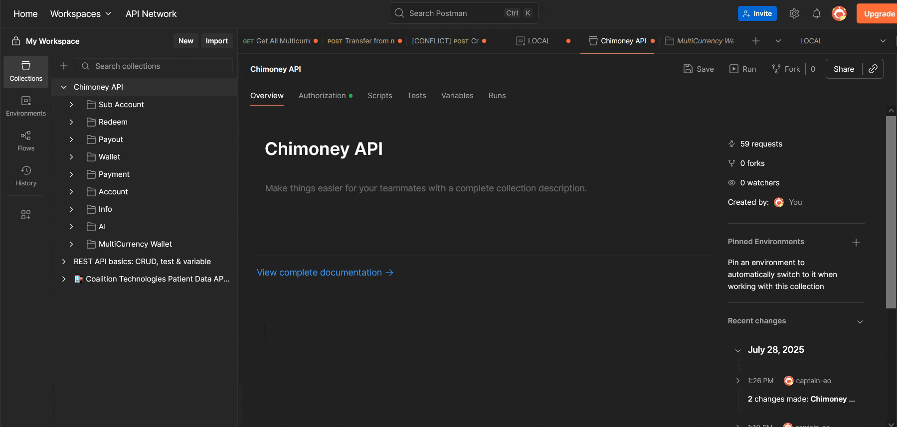

# How to Make a Multi-Currency Wallet Transfer with Chimoney

This guide walks you through how to set up your environment to make a multi-currency transfer using the Chimoney API.

By the end of this guide, you will be able to:

- Retrieve your Chimoney API key
- Set up your Postman or cURL environment
- Create a multi-currency wallet
- Make authenticated test transfer requests to the `/multicurrency-wallets/transfer` endpoint

## Prerequisites

To follow this guide, you will need the following:

- A Chimoney Developer Sandbox account ([Sign up here](https://chimoney.readme.io/reference/sandbox-environment) if you do not have one)
- Access to your Chimoney **API Key** (available in the Developer Dashboard)
- A stable internet connection

<aside>
❗

This guide assumes no prior setup. You can use either Postman or cURL to make requests. Both options will be provided.

</aside>

## Set Up Environment

In this section, you will prepare your environment to make authenticated API requests to the Chimoney API.

You can choose to proceed using either:

- [Postman](https://www.postman.com/) (recommended) or
- **cURL** (for developers comfortable with the command line)

### Postman Setup

The Chimoney API offers a Postman collection where you can test every public endpoint on the API. Ensure you have a Postman account before you proceed with the setup.

1. Go to the [Chimoney Postman Collection](https://documenter.getpostman.com/view/26097715/2sA3kXCzD2) page and click on the “Run in Postman” button


This will open the collection in your Postman account, where you will have local access to all the endpoints in the API collection.

1. In the “Environments” tab, create a test environment and configure the base URL shown below as a global variable named `{{base_url}}`. You can name it whatever you like.

```bash
# base URL
https://api-v2-sandbox.chimoney.io/v0.2
```


1. At the top folder level, navigate to the “Authorization” tab and set your API key. Use `X-API-Key` as the key and your actual API key as the value:



Great! You have successfully set up your Postman environment with authentication and base URL at the global level for easy access.

### cURL Setup (Optional)

If you prefer the command line, you can test with cURL. The command below will create a multi-currency wallet. Copy and paste into your terminal:

```bash
curl -X POST https://api-v2-sandbox.chimoney.io/v0.2/multicurrency-wallets/create \
  -H "X-API-KEY: your-api-key-here" \
  -H "Content-Type: application/json" \
  -d '{
    "name": "John Doe",
    "email": "john.doe@mail.com",
    "firstName": "John",
    "lastName": "Doe",
    "phoneNumber": "+16471234567"
  }'
```

<aside>
❗

Make sure you replace `your-api-key-here` with your actual API key

</aside>

## Create A Test Wallet

To make a multi-currency transfer, we need to create a test wallet to which we can send test funds.

Open the “MultiCurrency Wallet” folder in the left sidebar and navigate to the `Create New MultiCurrency Wallet` endpoint and in the “Body” tab, fill in the following request fields similar to the one in the cURL command above.

```json
{
  "name": "John Doe",
  "email": "john.doe@mail.com",
  "firstName": "John",
  "lastName": "Doe",
  "phoneNumber": "+16471234567",
  "meta": {}
}
```

After you have created the test wallet, copy the wallet ID `{ id: ' ', }` from your response, and proceed to make a test transfer in the next step.

## Make A Test Transfer

### Using Postman

In the “MultiCurrency Wallet” folder, navigate to the `Transfer from multicurrency wallet to another wallet, an email or a phone number` endpoint. In the “Body” tab, make sure the request data looks like this:

```json
{
  "amountToSend": "10",
  "originCurrency": "USD",
  "receiver": "edd499f4-bde8-4852-8d3c-047c30004eeb",
  "email": "john.doe@mail.com",
  "phoneNumber": "+23455854303",
  "destinationCurrency": "USD",
  "narration": "P2P Payment"
}
```

The `receiver` key represents the receiver’s wallet ID from the previous step.

<aside>
💡

Tip: Make sure you're selecting **POST** from the method dropdown (top left of the request tab)

</aside>

Even if you omit the wallet ID, you can still make a transfer using just `email` or `phoneNumber` as a user’s unique identifier. Feel free to play around with the values during your testing.

### Using cURL

The cURL version should look like the example below:

```bash
curl -X POST https://api-v2-sandbox.chimoney.io/v0.2/multicurrency-wallets/transfer \
  -H "X-API-KEY: your-api-key-here" \
  -H "Content-Type: application/json" \
  -d '{
    "amountToSend": "10",
    "originCurrency": "USD",
    "receiver": "edd499f4-bde8-4852-8d3c-047c30004eeb",
    "email": "john.doe@mail.com",
    "phoneNumber": "+23455854303",
    "destinationCurrency": "USD",
    "narration": "P2P Payment"
  }'
```

<aside>
💡

Use the `-i` flag to **include HTTP response headers** in your output

</aside>

### Expected Transfer Response

Make a request to the endpoint, and if all goes well, you should see a response that looks like this:

```json
{
  "status": "success",
  "data": {
    "paymentLink": "https://sandbox.chimoney.io/pay/?issueID=SqEYHip3Zwca0DCrC5OyP389i3q1_10_1753750268446",
    "data": [
      {
        "id": "bUXgB3VM1hvAie2xC4Ed",
        "email": "john.doe@mail.com",
        "valueInUSD": "10",
        "wallet": true,
        "narration": "P2P Payment",
        "type": "multicurrency-transfer",
        "chimoney": 10000,
        "issuer": "SqEYHip3Zwca0DCrC5OyP389i3q1",
        "issueID": "SqEYHip3Zwca0DCrC5OyP389i3q1_10_1753750268446",
        //.......
        "redeemLink": "https://sandbox.chimoney.io/redeem/?chi=59d65b75-4aca-45b6-919b-b5c19a41e208"
      }
    ],
    "chimoneys": [],
    "error": "None",
    "payouts": {
      "issueID": "SqEYHip3Zwca0DCrC5OyP389i3q1_10_1753750268446"
    }
  }
}
```

Congrats! You have successfully completed a multi-currency USD-to-USD transfer to a user’s wallet.

<aside>
💡

Postman allows you can create separate environments for Test and Production with their own API key and base URL.

</aside>

## Error Troubleshooting

Here are some common errors developers might face when testing, their possible causes and how to fix them:

| Error                       | Cause                              | Fix                                                             |
| --------------------------- | ---------------------------------- | --------------------------------------------------------------- |
| `401 Unauthorized`          | Missing or invalid API key         | Double-check that `X-API-KEY` is correct and present in headers |
| `400 Bad Request`           | Incorrect or incomplete body       | Ensure all required fields are included and valid               |
| `403 Forbidden`             | Insufficient permissions           | Confirm you're not using a test key in a production environment |
| `404 Not Found`             | Wrong endpoint or typo in URL      | Recheck the API endpoint path and method                        |
| `500 Internal Server Error` | Server-side issue or invalid input | Try again later or thoroughly check the input format            |

## Recommended Next Steps

- Check out Chimoney’s full [API reference](https://api.chimoney.io/v0.2.4/api-docs/)
- Explore the Chimoney [official documentation](https://chimoney.readme.io/reference/introduction)
- Dive into a real-world scenario in the [Use Case article](https://chimoney.io/usecases/Build-a-P2P-Payment-Platform/)
