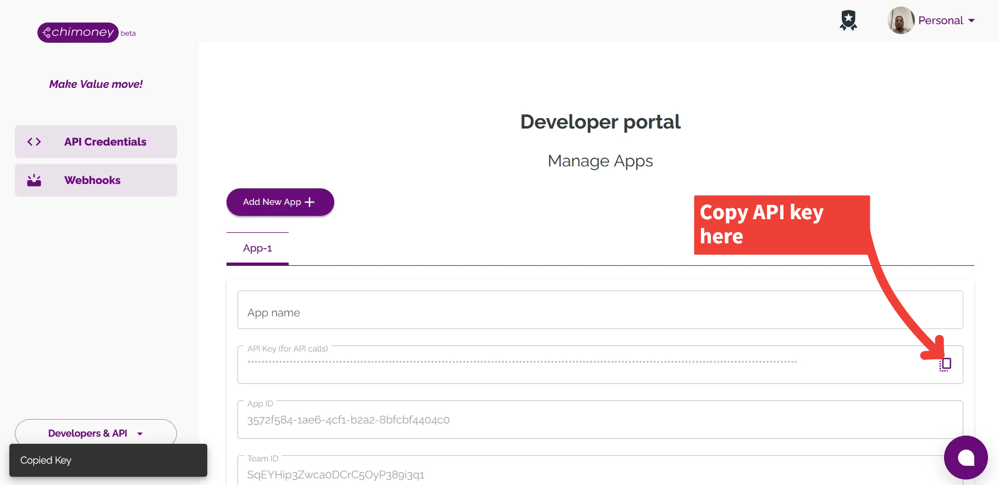
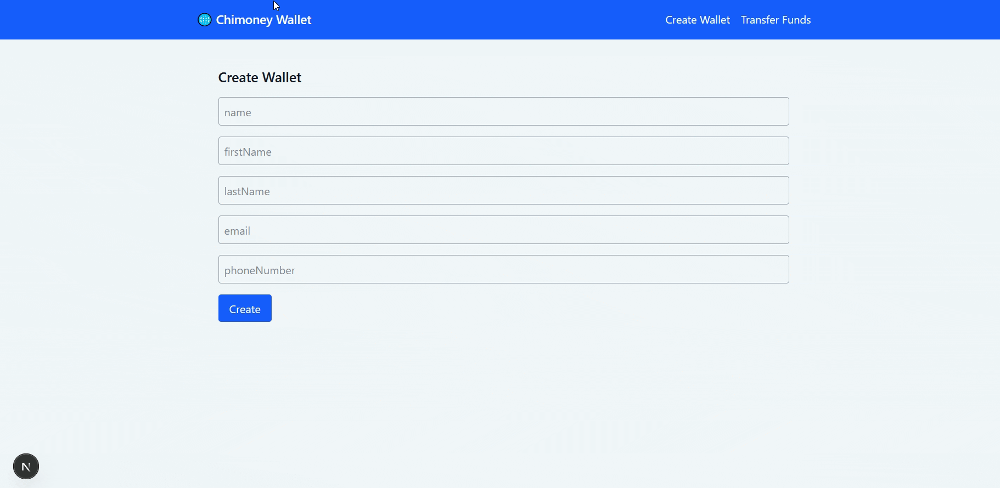
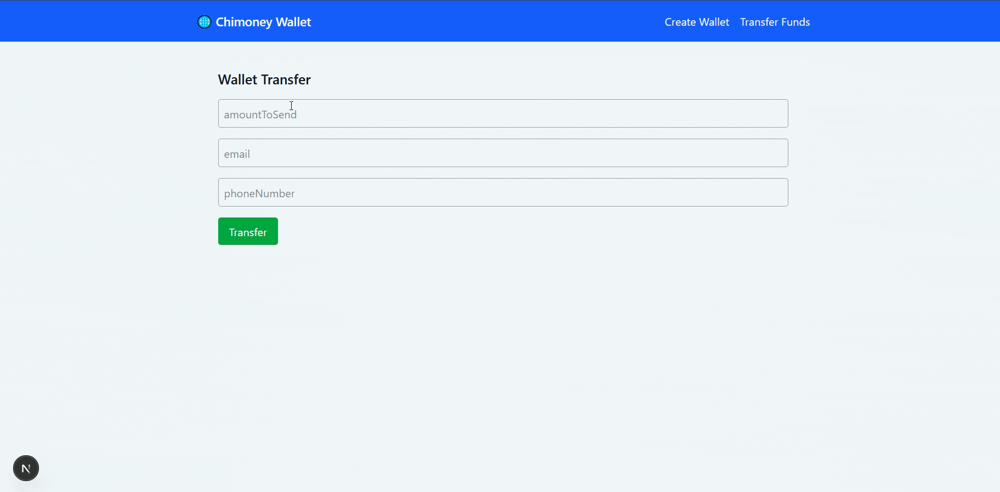

# Build a Global Payout Flow: Multi-Currency Wallet Tutorial using Chimoney

There’s no doubt that global payments have evolved over the years. Several payment innovations and services have emerged as vehicles for transferring money globally. Every freelancer, remote worker or online service in today’s economy needs a way to send and receive payment from almost anywhere in the world - and in different currencies as well.

In this tutorial, we will build and deploy a global payout flow using the Chimoney `multi-currency wallet transfer` API. By the end of this tutorial, you can perfectly simulate transfers between wallets using different currencies.

## Prerequisites

The scope of this tutorial is wide enough to accommodate all skill levels; however, it requires some basic proficiency in the following technologies:

- JavaScript/TypeScript
- Next.js (App Router)
- Node and NPM installed on your system

Additionally, you will need a Chimoney sandbox account and an API key. Follow the steps in [this page](https://chimoney.readme.io/reference/sandbox-environment) to set them up.

## Get Your Chimoney API Key

This tutorial will be based on the Chimoney Sandbox environment, which allows developers like you and me to create an account and obtain an API key for testing purposes.

Follow the instructions [on the Chimoney docs](https://chimoney.readme.io/reference/sandbox-environment) to set up your Sandbox environment and obtain your API key. After following the steps from the link, you should see something like the image below:



## Set Up Next.js Environment

We will be using Next.js, the popular React framework, for this tutorial. A Next.js boilerplate code is already set up for you; it contains all the basic setup you will need for this tutorial. Head over to the [repository on GitHub](https://github.com/EOEboh/chimoney-p2p-demo) and do the following:

- fork the repo to create your version
- then clone the repo to your local machine.

Once the boilerplate is cloned, run the following command to install all the necessary dependencies:

```bash
npm install
```

## Add Your API Key as an Environment Variable

Remember the API key you obtained during the creation of your Sandbox account at the beginning? We will set it up as an environment variable as a secure way to reference it.

At the root (topmost) directory of your Next.js app, create a file called `.env.local`, then copy and paste the following code inside the file:

```bash
#.env.local
CHIMONEY_API_KEY=your_api_key_here
CHIMONEY_API_URL=https://api-v2-sandbox.chimoney.io/v0.2
```

<aside>
❗

Replace `your_api_key_here` with your actual API key from your Sandbox dashboard.

</aside>

Run the command below in your editor terminal to start your Next.js localhost server:

```bash
npm run dev
```

## Set Up API Route Handlers

According to the Next.js App router convention, we will set up route handlers to process any request to the API (as well as responses back from the API).

For the scope of this tutorial, we will set up two route handlers to handle two operations:

1. Create a multi-currency wallet (this is the wallet we will transfer to)
2. Make a multi-currency wallet transfer (to the wallet we created in step 1)

### Create Wallet Route

Inside your `app/api/wallet/create` folder, navigate into the `route.ts` file and paste the code block below:

```tsx
// src/app/api/wallet/create/route.ts

import { NextRequest, NextResponse } from "next/server";
export async function POST(req: NextRequest) {
  const body = await req.json();
  try {
    const response = await fetch(
      `${process.env.CHIMONEY_API_URL}/multicurrency-wallets/create`,
      {
        method: "POST",
        headers: {
          "Content-Type": "application/json",
          "X-API-KEY": process.env.CHIMONEY_API_KEY || "",
        },
        body: JSON.stringify(body),
      }
    );
    const data = await response.json();
    if (!response.ok) {
      return NextResponse.json(
        { error: data.error || "Failed to create wallet" },
        { status: 400 }
      );
    }
    return NextResponse.json(data);
  } catch (err) {
    return NextResponse.json({ error: "Server error" }, { status: 500 });
  }
}
```

What exactly is happening here? The code block above is a _route handler,_ and it is used to define the endpoint and handle our API logic directly within the Next.js app router. This file runs on the server, and your sensitive secrets, like the API key or base URL, cannot be exposed to the client.

We want to create a multi-currency wallet. This will be the wallet we will transfer test funds to, to simulate a real-time global payout.

This particular route handler will receive input values from the form (which we will set up in the next segment) and make a `POST` request to the `multicurrency-wallets/create` endpoint. Keep in mind, we are passing the API key as a credential to authenticate our request and receive a successful response. We are also handling any errors that may arise during the request-response cycle.

### Multicurrency Transfer Route

Before we proceed to creating the forms, we still have one more route handler to set up - the multi-currency transfer handler.

Navigate to the `app/api/wallet/transfer` folder, and inside the `route.ts` file, paste the following code:

```tsx
// src/app/api/wallet/transfer/route.ts

import { NextRequest, NextResponse } from "next/server";
export async function POST(req: NextRequest) {
  const body = await req.json();
  try {
    const response = await fetch(
      `${process.env.CHIMONEY_API_URL}/multicurrency-wallets/transfer`,
      {
        method: "POST",
        headers: {
          "Content-Type": "application/json",
          "X-API-KEY": process.env.CHIMONEY_API_KEY || "",
        },
        body: JSON.stringify(body),
      }
    );
    const data = await response.json();
    if (!response.ok) {
      return NextResponse.json(
        { error: data.error || "Transfer failed" },
        { status: 400 }
      );
    }
    return NextResponse.json(data);
  } catch (err) {
    return NextResponse.json({ error: "Server error" }, { status: 500 });
  }
}
```

Similar to the previous file, this route handler will process a multi-currency wallet transfer using the `multicurrency-wallets/transfer` endpoint via an HTTP `POST` request.

## Create A Multi-Currency Wallet

The first step of the process of building a global payout flow is to create a multi-currency wallet where we will send funds (not real funds). Each wallet also doubles as a user’s account because it can be uniquely identified by a wallet ID and is also tied to an individual. An email or phone number identifies this individual.

Head over to the `src/app/create-wallet` page, and you will find a form boilerplate already set up for you. This is to help us focus strictly on the API logic.

Let’s modify the `handleSubmit` function to handle the request and response logic:

```tsx
// src/app/create-wallet/page.tsx

const handleSubmit = async (e: React.FormEvent) => {
  e.preventDefault();
  const res = await fetch("/api/wallet/create", {
    method: "POST",
    body: JSON.stringify({ ...form, meta: {} }),
  });
  const data = await res.json();
  setResponse(data);
  console.log("Response:", data);
  if (data?.data?.id) {
    setWalletId(data.data.id);
  }
};
```

Let’s break down what is happening step-by-step:

1. The function makes a `POST` request to the `/api/wallet/create` route handler we created earlier.
2. We await the response from the API and parse it to `JSON` format
3. Save the response data using the `setResponse` state
4. Save the wallet ID using the `setWallet` state, we will need the ID to transfer funds to the wallet in the next step.

Great work so far! We have now successfully set up our multi-currency wallet creation logic.

Now let’s go over to the UI and test what we have done. Ensure you start your Next.js development server by running the following command:

```bash
npm run dev
```

In your [localhost:3000/create-wallet](http://localhost:3000/create-wallet) page, fill out the form details and click the “Create” button as demonstrated below:



Behind the scenes, we are sending the form values as body parameters to the API in this format:

```json
{
  "name": "John Doe",
  "firstName": "John",
  "lastName": "Doe",
  "email": "john.doe@mail.com",
  "phoneNumber": "+234101000100",
  "meta": {}
}
```

The response from the API should look something like the JSON format below:

```json
{
  "status": "success",
  "data": {
    "id": "edd499f4-bde8-4852-8d3c-047c30004eeb",
    "name": "John Doe",
    "email": "john.doe@mail.com",
    "phoneNumber": "+234101000100",
    "meta": {
      "email": "john.doe@mail.com"
    },
    ........
  }
}
```

Let’s explain a few parameters:

- `status`: Tells you the wallet creation was successful
- `data`: Contains the created wallet's information
- `id`: This is the unique wallet ID

Congratulations, you have just successfully created a multi-currency wallet. Next steps will be to make a multi-currency transfer.

## Make A Multi-Currency Transfer

Navigate to the `src/app/transfer` page, and similar to the last step, you will also find a form boilerplate already set up. Once again, the `handleSubmit` function is our focus.

Remember, we saved the wallet ID from our previous operation using React Context state. Therefore, we will extract that wallet ID from the Context and fill it as our receiver. We are making a multi-currency transfer to the wallet we created earlier.

Paste the following code:

```tsx
// src/app/transfer/page.tsx

const handleSubmit = async (e: React.FormEvent) => {
  e.preventDefault();
  const res = await fetch("/api/wallet/transfer", {
    method: "POST",
    body: JSON.stringify({ ...form, receiver: walletId }),
  });
  const data = await res.json();
  setResponse(data);
};
```

Before we make the request, let’s break down what we are sending to the endpoint in JSON:

```json
{
  "amountToSend": "",
  "originCurrency": "USD",
  "destinationCurrency": "USD",
  "narration": "P2P Payment",
  "email": "",
  "phoneNumber": ""
}
```

Go back to the [localhost:3000/transfer](http://localhost:3000/transfer) page on your browser and make a multi-currency transfer using the form:



<aside>
❗

If your transaction fails, it is likely that you had refreshed your browser and lost the `walletId` saved in state.

</aside>

## Verify Transfer

You can verify this transaction using the [`payment verify`](https://api.chimoney.io/v0.2.4/api-docs/#/Payments/post_v0_2_4_payment_verify) endpoint. This would require the transaction ID `{ issueID:'', }` from the response of your last step.

Verifying your transaction should produce a response like the one below. The response tells us our last transfer was successful, and the wallet is credited with $10.

```json
{
  "status": "success",
  "data": {
    "id": "qaqSGhRIB9q7nvg1xSu4",
    "receiver": "edd499f4-bde8-4852-8d3c-047c30004eeb",
    "valueInUSD": "10",
    "wallet": true,
    "narration": "P2P Payment",
    "type": "multicurrency-transfer",
    "redeemData": {
      "receiver": "edd499f4-bde8-4852-8d3c-047c30004eeb",
      "valueInUSD": "10",
      "wallet": true,
      .............
    }
  }
}

```

Congratulations! You just sent a successful payout to a wallet.

More features, like creating a subaccount and currency conversions, are available on the [Chimoney API](https://api.chimoney.io/v0.2.4/api-docs/).

## Conclusion

In this tutorial, we walked through how to use the Chimoney API to build a global payout system with support for multi-currency wallet transfers. To explore more features, such as additional transfer options, wallet management, and advanced integrations, be sure to visit the official [Chimoney API documentation](https://chimoney.readme.io/reference/post_v0-2-4-multicurrency-wallets-transfer).

Happy building!
