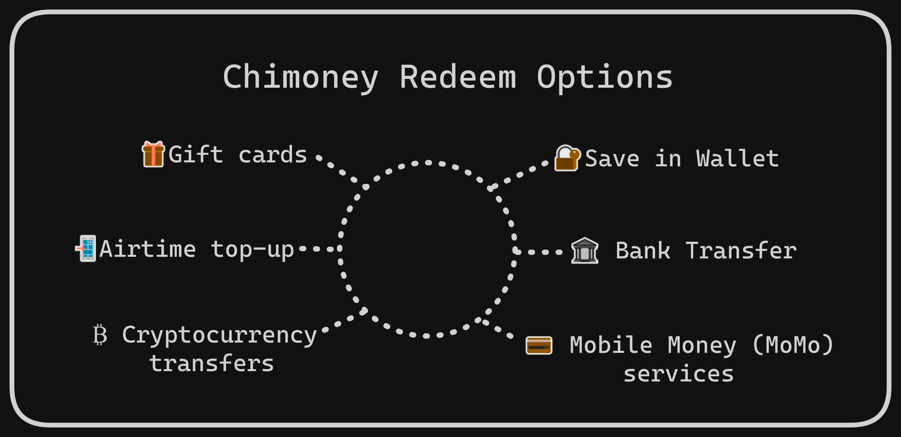
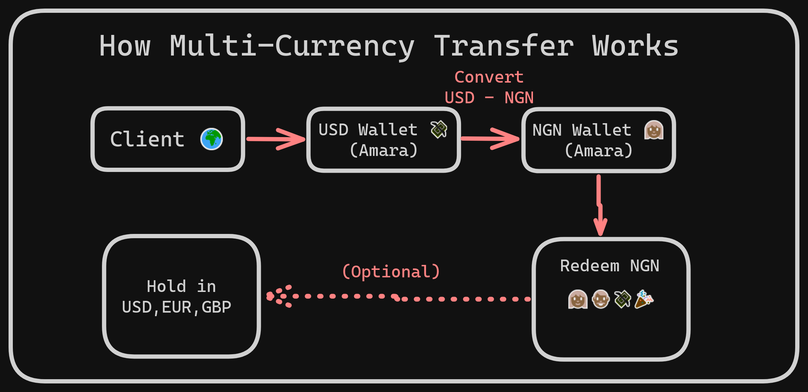

# Chimoney Multi-Currency Wallet Transfers: A Practical Solution for International Payouts

## Meet Amara - A Global Freelancer

Imagine a scenario where Amara, a designer, runs a remote freelance business and works regularly with clients from the US, Europe and maybe Canada. After each delivery, her foreign clients pay her in USD; ultimately, she and her team of designers based in Lagos will need to be paid in the local NGN currency. However, there are a number of issues that Amara traditionally has to deal with - the bank delays, the manual effort of juggling currency conversions, the ever-changing rates and even high charge fees.

Amara has faced several pain points that traditionally come with international money transfers. Most traditional banks have slow processing times and charge high fees, many platforms do not support multi-currency payouts, and currency conversions can be tricky to navigate, amongst other issues.

## The Problem with Traditional Methods

The traditional methods of receiving global payments not only come with the problem of high transfer fees but also other issues, such as complex user onboarding, limited control and poor currency conversion rates. Many of these methods even require automatic conversion to the local currency, which can likely result in the user losing some of their monetary value.

While more traditional services like Wise, Payoneer and PayPal may cater mainly to businesses and freelancers, Chimoney’s multi-currency wallet transfer feature (which we will introduce next) offers a flexible wallet-based infrastructure that supports both peer-to-peer and en masse payouts. A modern and competitive solution to most payout issues. With this feature, users can hold or spend the money they receive in their local currency or another preferred currency of choice or even both. This eliminates forced conversions, which could make the user lose money due to unfavourable exchange rates at the time.

## A Smarter Way to Move Money: Chimoney’s Multi-Currency Transfer

Now, imagine a different scenario where Amara’s payment process is completely streamlined. Her foreign clients pay her in USD (or any other supported currency). She receives the funds into a digital wallet, converts them to any currency of her choice, and also pays her team members in NGN - all in one place! This is what Chimoney’s multi-currency wallet transfer feature provides.

What makes this feature more impressive is that users and businesses like Amara’s can receive and send money in various currencies without even needing multiple bank accounts or juggling exchange platforms.

What’s even better? Amara can send payouts directly to her team members even if they do not have a Chimoney account. Chimoney generates a secure payment link that allows the recipient to redeem their money in the currency they prefer and through a variety of options, such as:

- **Bank transfers** to local bank accounts (in supported countries)
- **Mobile Money** (MoMo) services in over 10 countries
- **Airtime top-up** directly to mobile numbers
- **Gift cards** from numerous retail or digital brands
- **Cryptocurrency transfers** (where regulations allow)
- Option to **save funds for later** in the Chimoney wallet

Beyond these features, Chimoney also takes care of identity verification (KYC) automatically, so users can focus on what matters most: the main business operations like sending or receiving funds.

## How Multi-Currency Wallet Transfers Work

To further illustrate the process of how the multi-currency transfer works, we will break it down into a few simple steps:

1. Amara’s client funded her Chimoney USD wallet
2. She converts the amount from USD to NGN at real-time rates
3. She sends payments to her team in NGN directly from her wallet
4. Her team can receive the payment in their local bank account or any of the redeemable options listed earlier
5. Amara can even choose to hold some funds in different currencies for future purposes (Optional)

The diagram below provides a visual representation of how the process would work:

## Why This Matters

Chimoney’s multi-currency wallet transfer is not just about receiving payment - it simplifies global money movement into one pipeline. It eliminates the bottlenecks associated with working internationally and provides a convenient way to receive and transfer funds across currencies.

With Chimoney’s multi-currency wallet transfer:

- Freelancers can now focus on their work, not payment logistics
- Remote teams can now get paid faster and in their local currencies
- SaaS tools can now integrate seamless payment flows using the multi-currency API, and so many more use cases.

Also, since this solution takes an API-first approach, it takes away adaptation limitations. Developers can easily leverage the API to build modern app payment solutions.

The following table highlights the core issues the multi-currency wallet transfer feature solves:

| **Core Issue**                                                             | **Solved by Chimoney Multi-Currency Wallet Transfer**                                         |
| -------------------------------------------------------------------------- | --------------------------------------------------------------------------------------------- |
| Lack of multi-currency control                                             | Users can hold and transfer multiple currencies in one wallet. No need for forced conversion. |
| Cross-border transfer complexity                                           | Transfer money across countries instantly using Chimoney wallets -no banks or intermediaries. |
| Limited access for recipients without bank accounts and debit/credit cards | Recipients only need an email or phone number. No bank account required.                      |
| Complex or strenuous KYC process                                           | KYC identification is automatically handled by Chimoney.                                      |
| High fees and poor exchange rates                                          | Transfers avoid unnecessary conversions and hidden charges, preserving more value.            |
| Difficult integration for developers                                       | Comes with simple, well-documented APIs to programmatically initiate and manage transfers.    |

## Conclusion

Chimoney’s multi-currency wallet transfer is built for anyone who values speed, flexibility, and convenience in global payments. Whether you're a freelancer, a remote team, or a platform looking to streamline payouts, it simplifies the way money moves across borders, offering the tools you need to thrive in today’s fast-moving digital economy.
