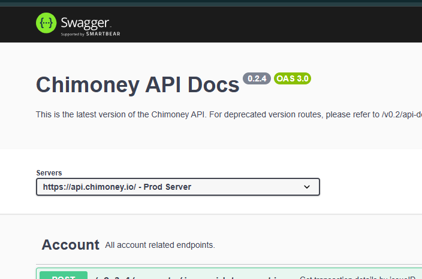
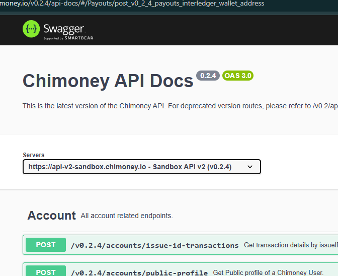
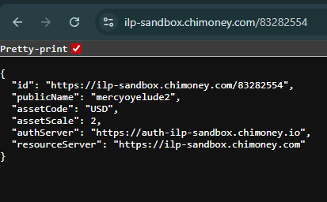

# How to Use Chimoney’s Interledger Wallet Address Payout Endpoint
> Endpoint: `/payouts/interledger-wallet-address`

Before you jump into integrating Chimoneys payout API, here is a quick walkthrough to get everything set up and ready to roll.

---

## 🧰 Prerequisites

Before diving in, make sure you have the following:

- 🔐 **Chimoney Developer Account**  
  Create one here: [chimoney.io/developers-api](https://chimoney.io/developers-api)
  
  Account is funded with $1000(10000 Chimoney) of test amount.

- 🔑 **API Key**  
  Grab it from your dashboard. Need help? [Watch this video](https://www.loom.com/share/436303eb69c44f0d9757ea0c655bed89?sid=b6a0f661-721c-4731-9873-ae6f2d25780)

- 💳 **Interledger Wallet Address**  
  Found on your dashboard after login. It will look something like:  
  `https://ilp-sandbox.chimoney.com/your-unique-id`  
  _(You do not need to memorize it.)_

- 🧪 **API Testing Tools**  
  Use any of the following:
  - Postman
  - Curl
  - Your favorite HTTP client (e.g. Axios, Fetch)

- 🧠 **Basic Knowledge of REST APIs**  
  You will be working with `POST` requests and JSON payloads.

---

## 🚀 Test the Endpoint in the API Explorer

Let us make a test call using Chimoney’s Swagger (API explorer):

1. Go to [Chimoney’s API Explorer](https://api.chimoney.io/v0.2.4/api-docs/#/Payouts/post_v0_2_4_payouts_interledger_wallet_address)
2. Switch to `sandbox mode` (top-left dropdown)

<!--  -->




3. Click **Authorize** and paste your API key
4. [Jump](https://api.chimoney.io/v0.2.4/api-docs/#/Payouts/post_v0_2_4_payouts_interledger_wallet_address) to `POST /payouts/interledger-wallet-address`
5. Replace the `interledgerWalletAddress` field with your own ILP address
6. Hit **Execute**

Boom — your first test payout should go through if all is set up correctly ✅

---

## 🛠 Common Errors and How to Fix Them

### ❌ Error: `CAD is not enabled for the interledger Wallet Address`
```json
{
  "status": "error",
  "message": "CAD is not enabled for the interledger Wallet Address (Payment Pointer), https://ilp-sandbox.chimoney.com/********"
}
```


### 💡 Why it happens:
Your ILP wallet only supports USD (not CAD).

### ✅ Fix: Change both currency fields to USD:
```json
"currency": "USD",
"debitCurrency": "USD"
```

🕵️‍♀️ Pro tip: Open your ILP wallet address in a browser to confirm supported assets.




### ❌ Error: `sender must be a valid Chimoney user ID`

### 💡 Why it happens:
You have either included an invalid subAccount or do not need one.

### ✅ Fix:

- Don’t have a subAccount? Just remove the field.

- Or go to your dashboard → Transactions tab → copy your user ID.

---

## Other API Responses
Once your request goes through, here’s what you might see:

### ✅ 200 OK – Success
```json
{
  "status": "success",
  "message": "Chimoney payout to Interledger wallet completed successfully",
  "data": {
    "paymentLink": "https://sandbox.chimoney.io/pay/?issueID=...",
    "chimoneys": [
      {
        "interledgerWalletAddress": "https://ilp-sandbox.chimoney.com/your-id",
        "amount": 200,
        "currency": "USD",
        "chiRef": "some-unique-id"
      }
    ],
    "redeemLink": "https://sandbox.chimoney.io/redeem/?chi=..."
  }
}
```
Use the `paymentLink` or `redeemLink` to simulate or test payouts end-to-end.


### ⚠️ 400 / 401 / 403 – Invalid or Unauthorized Request

```json
{
  "status": "error",
  "error": "sender must be a valid Chimoney user ID"
}
Or:
{
  "status": "error",
  "message": "Unauthorized – API key missing or invalid"
}
```

Refer to the **Common Errors** section above to resolve these.

### 💥 500 – Internal Server Error
```json
{
  "status": "error",
  "type": "InternalError",
  "code": "SERVER_ERROR",
  "message": "Something went wrong"
}
```
If this happens, double-check your payload format or retry later.

---

## Wrapping Up
That is it! At this point, you should be able to:

- Authenticate using your API key

- Locate and use your ILP wallet address

- Make a test payout request via the API Explorer

- Troubleshoot common errors like currency mismatch or sender ID issues

### 🎯 Next Step: Integrate the API in your project

Now that you are all set up, let us write some code and make payouts from your app.

**Happy building!** 🙌