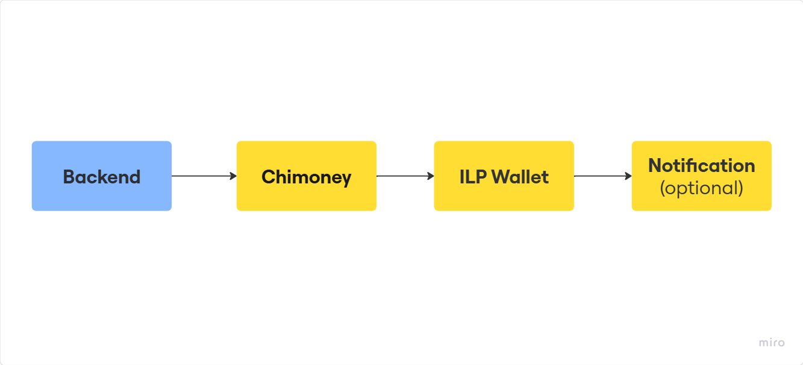

# Global Payment via Chimoney’s Interledger Wallet Address
---

## 📘 Scenario

You are running a global hackathon, write-a-thon that will be rewarding participants across borders. Rather than managing complex banking setups for each country, you want to send fast, secure payments directly to Interledger-enabled wallets using Chimoney.

---

## 🚀 Why This Use Case?

- 🌎 Pay participants across borders without worrying about banking differences
- ⚡ Instant value transfer via Interledger Protocol (ILP)
- 💵 Support multiple currencies like USD
- 📱 Easy integration into your existing backend or platform

---

## 🔄 Flow Overview

### 🪜 Flow - Step-by-Step

1. ✅ **Winners Announced:** Hackathon winners are announced.
2. 🧮 **Payout Calculated:** Your backend calculates how much to send.
3. 🛰 **API Call Sent:** Your app sends a `POST` request to the `/payouts/interledger-wallet-address` endpoint with:
   - Their ILP address
   - Amount in USD
   - Narration
4. 💸 **Chimoney Handles Transfer:** Chimoney routes and completes the payout to the ILP wallet.
5. 📬 **Notification (Optional):** You can trigger an email or in-app notification to the freelancer.

### 📊 Flow Diagram


---

## 🧰 Prerequisites

- ✅ Chimoney Developer Account ([Create one](https://sandbox.chimoney.io/))
- 🔑 API Key (Grab from dashboard)
- 🌐 Valid Interledger Wallet Address (`https://ilp-sandbox.chimoney.com/<your-id>`)
- 🛠 Postman, Curl, or your preferred HTTP client

---

## 📤 Sending the Payout

Here’s a real request example using the `/payouts/interledger-wallet-address` endpoint:

```json
POST /v0.2.4/payouts/interledger-wallet-address
Host: api-v2-sandbox.chimoney.io

Headers:
  X-API-KEY: Bearer YOUR_API_KEY

Body:
{
  "turnOffNotification": false,
  "debitCurrency": "USD",
  "interledgerWallets": [
    {
      "interledgerWalletAddress": "https://ilp-sandbox.chimoney.com/your-id",
      "currency": "USD",
      "amountToDeliver": 10,
      "narration": "Congratulations on emerging hackathon winner!",
      "collectionPaymentIssueID": "hackathon-001"
    }
  ]
}
```

✅ Success Response

```json
{
  "status": "success",
  "message": "Chimoney payout to Interledger wallet completed successfully",
  "data": {
    "paymentLink": "https://sandbox.chimoney.io/pay/?issueID=...",
    ...
  }
}
```

---

## ❗ Common Errors

### 🛑 CAD is not enabled

```json
{
  "status": "error",
  "message": "CAD is not enabled for the interledger Wallet Address..."
}
```

**Fix:** Use "USD" for both currency and debitCurrency

### 🛑 Invalid Chimoney User ID
```json
{
  "error": "sender must be a valid Chimoney user ID"
}
```
**Fix:** Remove or correct the subAccount field.

---

## 💡 Wrap-up
Not limited to one-time payments, with just a few lines of code, you can automate freelancer/employees payouts globally. Chimoney + Interledger makes cross-border payments smooth, developer-friendly, and scalable.

### ✨ Real-World Extensions
Here are more ways to apply this payout flow:

- #### Open-source contributor rewards
Automate thank-you payouts for contributors using their ILP wallet address (e.g. via GitHub Actions or Discord bots).

- #### Content creation platforms
Pay writers, creators, or community moderators directly based on engagement or content milestones.

- #### Job boards or marketplaces
Trigger seamless payouts to service providers upon completion of gigs or tasks.

- #### Hackathons and community events
Send rewards at scale without dealing with traditional banking headaches.

---

## Next Step:
🎯 Integrate this API flow into your backend and trigger payouts with this [tutorial](./tutorial.md)!