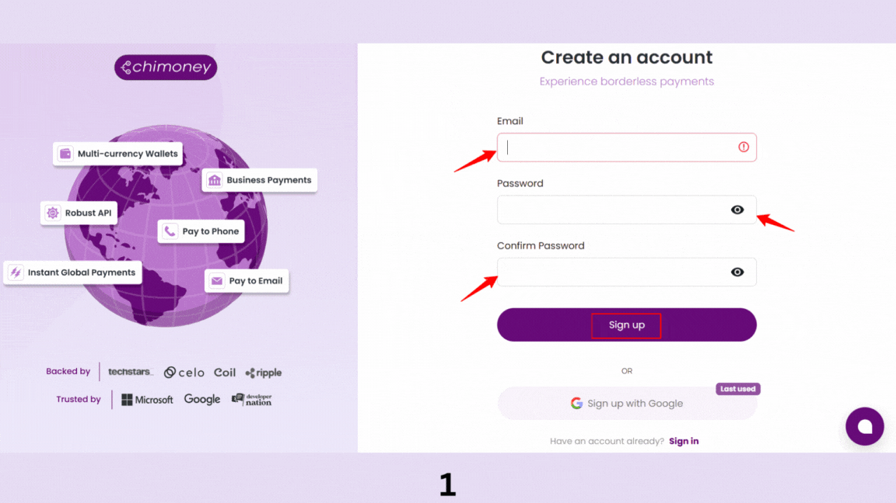

# Chimoney Create Interledger Wallet Address Tutorial


In this tutorial, you’ll learn how to use Chimoney’s create interledger wallet address endpoint to send money to an Interledger wallet address.

This guide will walk you through the process step-by-step, from setting up your account to making your first API call.

## Table of Contents

1. [Overview](#overview)
2. [Setup Guide](#setup-guide)
3. [Conclusion](#conclusion)

## Overview
Chimoney’s Interledger Wallet Address is a digital account associated with a user that enables seamless, secure, and instant cross-border transactions using the Interledger Protocol (ILP). This wallet address acts like a virtual bank account on the blockchain or digital asset network, allowing users to send and receive international payments efficiently.

### Purpose of the Documentation
This documentation provides a comprehensive guide on how to set up your Chimoney account, obtain your API key, and make your first API call to create an Interledger wallet address. It is designed for developers looking to integrate Chimoney’s Interledger capabilities into their applications.

### Benefits of Using Chimoney’s Interledger Wallet Address
- **Global Reach**: Send and receive payments across borders without the need for traditional banking systems.
- **Instant Transactions**: Enjoy near-instantaneous transfers, reducing waiting times associated with traditional banking.
- **Low Fees**: Benefit from lower transaction costs compared to conventional money transfer methods.
- **Secure and Reliable**: Built on blockchain technology, ensuring high security and reliability for transactions.

## Setup Guide
This section will guide you through the setup process to create an Interledger wallet address using Chimoney’s API.

### Step 1: Create a Sandbox Account & Get Your API Key


1. Go to the [sandbox.chimoney.io](https://sandbox.chimoney.io) and sign up for a new account.
2. Once you have created your account, log in to the Chimoney dashboard.
3. Navigate to the API section and generate a new API key. Make sure to save this key securely, as you will need it to authenticate your API requests.
4. You will also need your `teamId`, which is used as the `userId` in API requests. 
5. Ensure you have a unique `ilpUsername` (e.g., `jane.doe`) that will be used in your API requests.


### Step 2: Make Your First API Call
#### 1. Set Up Authentication in Postman
1. Open Postman and create a new request.
2. In the request settings, go to the "Authorization" tab.
3. Select "Bearer Token" as the type and enter your API key in the token field.

#### 2. Configure Request Body
1. Set the request method to POST.
2. Enter the following URL: `https://api.chimoney.io/v1/interledger/wallets`
3. In the "Body" tab, select "raw" and choose "JSON" as the format.
4. Enter the following JSON payload:
```json
{
  "user_id": "USER_ID"
}
```
Replace `USER_ID` with the ID of the user for whom you want to create the wallet address.


#### 3. Send & Verify
1. Click the "Send" button to make the API call.
2. If the request is successful, you will receive a response containing the new Interledger wallet address.

#### 4. Common Errors & Fixes
- **Error 401: Unauthorized**: This error occurs when the API key is missing or invalid. Double-check your API key and ensure it is included in the request headers.
- **Error 400: Bad Request**: This error indicates that the request payload is malformed. Ensure that you are sending a valid JSON payload with the required fields.
- **Error 500: Internal Server Error**: This error is returned when there is an issue with the Chimoney API. If you encounter this error, try again later or contact Chimoney support.

#### 5. Troubleshooting Tips
- Ensure that you are using the correct API endpoint and HTTP method.
- Double-check your request headers and payload for any errors.
- If you continue to experience issues, consult the Chimoney API documentation or reach out to their support team for assistance.

## Conclusion

In this tutorial, you learned how to use Chimoney’s create interledger wallet address endpoint to generate a new Interledger wallet address for a user. You also learned how to authenticate your API requests and handle common errors. With this knowledge, you can now integrate Chimoney’s Interledger capabilities into your applications.